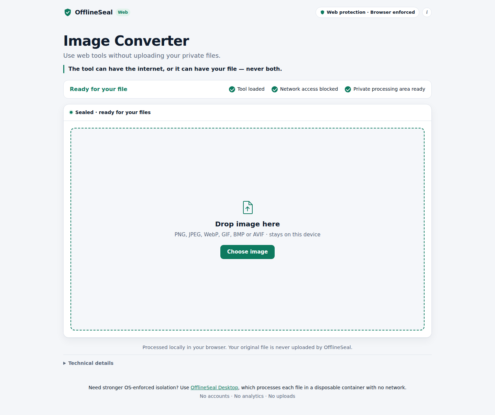

# OfflineSeal

> **The tool can have the internet, or it can have your file — never both.**

OfflineSeal lets you use software on private files without sending those files to
the software's owner. The tool comes to your data, instead of your data going to
the tool. OfflineSeal first loads the tool completely, then seals off its network
access, and only then lets your file in.

OfflineSeal has two editions, with two different levels of assurance:

```
OFFLINESEAL WEB                         OFFLINESEAL DESKTOP
───────────────                         ───────────────────
Shareable HTTPS URL                     Local application/runtime
Zero installation                       Disposable per-file containers
Local browser processing                Network namespace isolation
Browser-enforced isolation              OS-enforced boundary
```

They share the same idea, but they do not make the same security claims. Desktop is
the high-assurance edition: every file is processed in a fresh container with no
network, enforced by the operating system. Web is the convenient edition: the
browser's sandbox and Content Security Policy keep the tool off the network. It is
not OS-level isolation.

## OfflineSeal Web

[`web/`](web/) is a self-contained static web application. It has two tools,
the **Image Converter** at `/image` and **PDF Tools** (merge, split, rotate,
reorder) at `/pdf`. Both run on one shared sealed runtime. Open a link, wait for
**Ready for your file**, then drop your files. They go into a sandboxed frame.
Each job runs there in a fresh, network-less Web Worker, which is destroyed as
soon as the job ends. The result is saved as a normal download. Nothing is
uploaded.

A tool is a declarative manifest plus Worker-only code. The frame runtime is
byte-identical for every tool, and tools cannot extend it. PDF Tools was built
as the test of that contract: it needed no new privileges in the frame.

- Architecture, security boundary, exact policies and limits: [`web/README.md`](web/README.md)
- Deployment: [`web/deploy/README.md`](web/deploy/README.md)
- Tests: `cd web && npm ci && npm test`



## OfflineSeal Desktop

OfflineSeal Desktop processes each file in its own disposable container with
Docker `network=none`, a read-only root, and a pinned, verified tool. The container
is destroyed after each file.

The Desktop edition's source is not in this repository yet. OfflineSeal Web does
not depend on it or share any code or runtime with it. Web lives entirely under
`web/`, so it cannot pick up Desktop's host or agent privileges.

## Repository layout

```
web/                  OfflineSeal Web (static site, no server-side code)
  src/policy.mjs      every sandbox/CSP/header policy, in one place
  src/shell/          the outer, network-capable page (never touches your file)
  src/runtime/        the sealed runtime: frame UI, Worker host, manifest schema,
                      Worker protocol (identical for every tool)
  src/tools/          the tools: manifest.json + Worker-only code each
                      (image-converter/, pdf-tools/)
  build.mjs           builds web/dist/ and the host header files
  server/serve.mjs    local static server that applies the same headers
  test/               unit + browser (Playwright: Chromium, Edge) tests,
                      including a hostile tool that must stay contained
  deploy/             hosting guide and nginx example
  docs/               screenshots and network evidence
```
