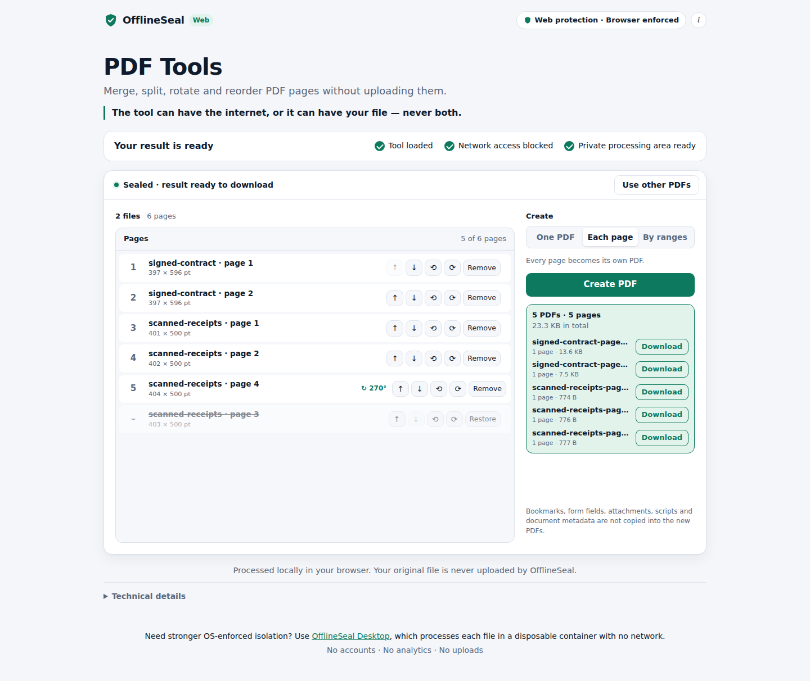

# OfflineSeal Web

> The tool can have the internet, or it can have your file — never both.

OfflineSeal Web is the zero-install edition of OfflineSeal. You open a link in a
normal browser. The page downloads the tool, seals it inside a browser sandbox
with no network access, and only then lets your files in. Everything happens on
your device, and results are saved as normal downloads.

**Processed locally in your browser. Your original file is never uploaded by OfflineSeal.**

Tools in this release:

| Path | Tool | What it does |
|---|---|---|
| `/image` | Image Converter | PNG, JPEG, WebP, GIF, BMP or AVIF in; PNG, JPEG or WebP out, with resizing |
| `/pdf` | PDF Tools | Merge several PDFs; reorder, rotate and remove pages; split into one PDF per page or by ranges |

| | OfflineSeal Web | OfflineSeal Desktop |
|---|---|---|
| Delivery | Shareable HTTPS URL, nothing to install | Local application and runtime |
| Where files are processed | A disposable Worker inside a sandboxed frame in your browser | A disposable container on your computer |
| Isolation | **Browser-enforced** (iframe sandbox + Content Security Policy) | **OS-enforced** (network namespace, `network=none`) |
| Claim | Browser policy stops the tool from making network requests | The tool is physically disconnected from the network |

The two editions share the same idea, but they do not make the same security
claims. Web mode never claims OS-level isolation.



---

## A small trusted runtime, and tools that are only data plus Worker code

OfflineSeal Web is a **runtime** plus **tools**. The runtime is the only code
that runs in the sealed frame, and it is byte-identical for every tool. A tool
is exactly two things:

1. **A manifest** (`manifest.json`). It declares which files the tool accepts,
   which controls to show, which output types it may produce, and its time
   limits. The runtime validates it, then renders it using a fixed set of
   components.
2. **Worker code** (`*.js`). It runs only in disposable Workers: no DOM, no
   frames, no navigation, no storage, no network. It registers two functions,
   `inspect(files)` and `run(files, params)`.

A tool **cannot** ship HTML, CSS or frame code. It cannot add a component,
choose a download's name or extension, produce an undeclared or non-inert
output type, or send the frame anything outside the protocol. The contract is
in [`src/runtime/tool-schema.js`](src/runtime/tool-schema.js).

```
src/
  runtime/                 the trusted, tool-agnostic layer
    frame.js               runs in the sealed frame: renders manifests, runs Workers, validates results
    frame.html, frame.css  the frame's markup and style (the same for every tool)
    tool-schema.js         the contract: manifest schema, component vocabulary, result/param checks
    worker-protocol.js     frame <-> Worker messages
    worker-host.js         the generic part of every tool Worker
    seal-check.js          the seal self-check, shared by the frame and Workers
  tools/
    image-converter/       manifest.json, image-core.js, tool.js
    pdf-tools/             manifest.json, pdf-core.js, tool.js
  shell/                   the outer page (network-capable, never touches files)
```

### The component vocabulary

| Component | What the user sees | Value sent to `run` |
|---|---|---|
| `choice` | Segmented options. They can be narrowed by the tool's self-check (e.g. only the encoders this browser has). | one declared option |
| `range` | Slider | number within min–max |
| `dimensions` | Width × height, keep-proportions, % presets | `{width, height}` within the declared pixel limits |
| `text` | Text field; only the characters in the manifest's pattern can be typed | string |
| `hint` | A line of text, optionally shown only for some choices | — |
| `itemList` | An ordered list, e.g. of pages: move up/down, rotate, remove/restore | `[{key, rotation}]` in the user's order |

Every control can be shown only when a `choice` has certain values
(`showWhen`). Labels and texts are plain strings rendered with `textContent`.

### The test that the boundary holds

The platform is only real if a second, quite different tool fits without
special hooks. PDF Tools is that tool: multiple inputs, a page list, several
outputs, and binary parsing. It uses exactly the same contract as the Image
Converter. Three things are checked automatically:

- **The executable frame script is byte-identical for every tool.** One CSP
  hash covers all of them. This is checked in the build output and again live
  in the browser (`test/unit/runtime-audit`, `test/e2e/platform`).
- **The runtime source contains nothing tool-specific.** No "pdf", "jpeg",
  "png", "webp" or "image/" anywhere in `frame.js`.
- **A deliberately hostile tool is contained.** Its Worker holds the user's
  file and tries to reach the network (fetch, POST, XHR, WebSocket,
  EventSource, `importScripts`, a nested Worker, `eval`). It tries to return
  an HTML download, an undeclared type, too many outputs, a fake Blob,
  oversized text and a path-traversal file name. It posts junk outside the
  protocol, bypasses the Worker host to rewrite its own validated result,
  hangs, and crashes. Every attempt is contained (`test/e2e/platform`). The
  hostile tool lives in `test/fixtures/tools/hostile` and is only ever built
  into a private test site.

### Adding a tool

1. Create `src/tools/<id>/manifest.json`, using the components above.
2. Write `src/tools/<id>/tool.js` (plus helper `.js` files, which are inlined
   first, in name order):
   ```js
   OfflineSealTool.define({
     selfCheck() { return { options: {} } },            // optional
     async inspect(files, ctx) { return { summary, preview?, controls? } },
     async run(files, params, ctx) { return { summary, preview?, outputs: [{ file: Blob, name, summary }] } },
   });
   // user-facing failure: OfflineSealTool.fail('invalid-input', 'Explain what is wrong.')
   ```
3. `npm run build`. The build validates the manifest with the runtime's own
   schema, and gives the tool a shell page at its `shell.path`.

No change to the runtime, the shell or the CSP is needed. If a tool seems to
need one, the manifest contract is what should change, deliberately and in
review.

---

## How it works

```
User opens /<tool>
  │
  ▼
Outer shell (network-capable, same-origin only)
  1. downloads the tool payload            GET assets/sealed/<tool>.sealed.txt
  2. verifies it against a pinned SHA-384  fetch(…, { integrity })   ── mismatch → refuse
  3. creates <iframe sandbox="allow-scripts allow-downloads" srcdoc=…> (inert)
  │
  ▼
Sealed frame (opaque origin, no network): the runtime
  4. removes WebRTC, reads the manifest and Worker code from the payload's
     inert data blocks, creates its one Trusted Types policy for Worker URLs,
     validates the manifest, then checks its own seal: origin is opaque · shell
     is unreachable · its own connect-src 'none' is enforced
  5. starts a throwaway self-check Worker (no user data): the Worker checks its
     own seal and reports the tool's capabilities → terminated
  6. posts `frame-ready`                   ── any check fails → `seal-failed` → shell shuts it down
  │
  ▼
Shell removes `inert`: READY
  │
  ▼
User drops or chooses files INSIDE the frame
  7. runtime checks metadata only (count, size, type, name), then hands the
     File handles to a fresh Worker: inspect → summary, preview, control values → terminated
  8. on the action button, another fresh Worker: run → validated outputs → terminated
  9. runtime offers each output Blob as <a download> under a name and type it controls
```

### Disposable Workers

Every job runs in its own brand-new dedicated Worker: the READY self-check, the
`inspect` of newly chosen files, and each `run`. The runtime terminates the
Worker the moment its job completes, fails, times out, is superseded, or its
result is rejected. Workers die with their frame.

- **One job per Worker; never two Workers alive at once.**
- **One set of files per frame.** Starting over destroys the frame, and with it
  any running Worker, before a new frame (and new Workers) exist.
- **No state carries over.** Each Worker is a fresh JavaScript global with an
  opaque origin: no IndexedDB, no Cache Storage, no cookies. The tests plant
  state in File A's Worker and confirm File B's Worker cannot see it.
- **Timeouts** come from the manifest (capped by the runtime at 10 minutes).
  The self-check has 5 s.

The invariant: **private file bytes are processed only inside a disposable
Worker, and destroying the Worker destroys the processing state.**

### Where your files exist and where they do not

| Place | Has the files or their bytes? |
|---|---|
| Processing Worker (opaque origin, no network, no DOM, no storage, lives for one job) | **Yes.** Reads the bytes, decodes, processes, writes outputs. |
| Sealed frame (the runtime) | **File handles**, which it passes to each job's Worker but never reads. **Preview bitmaps** from the Worker, shown through a `bitmaprenderer` canvas; their pixels are never read. **Output Blobs**, offered for download; their bytes are never read. The tests count every decode, canvas, `Blob`-read, `FileReader` and `Response` API call in the frame's realm and require zero, for both tools. |
| Your Downloads folder | The outputs you click to download. |
| Outer shell page | **No.** No file input, never reads drop data, receives only status messages, does not learn file names. |
| OfflineSeal's server | **No.** No upload endpoint or processing API; no request is made after READY. |

### The shell ↔ frame protocol

- One direction only: frame → shell. The shell never posts anything to the frame.
- Six fixed message types: `frame-ready`, `seal-failed`, `file-selected`,
  `processing-started`, `processing-complete`, `processing-failed`. Every
  message has exactly the keys `protocol`, `instance` and `type`, plus `code`
  on the two failure types, taken from a fixed list.
- Each message is checked for `event.source`, `event.origin === "null"`, the
  frame instance id, its exact shape, and whether it is allowed in the current
  lifecycle state. Anything else is dropped and counted.
- Nothing a message says can make the shell fetch, open, navigate, upload or
  run anything.

See [`src/shell/assets/protocol.js`](src/shell/assets/protocol.js).

### The frame ↔ Worker protocol (the same for every tool)

| Direction | Type | Exact payload (besides `protocol`) |
|---|---|---|
| frame → Worker | `self-check` | `job` |
| frame → Worker | `process` | `job`, `operation` (`inspect` or `run`), `files` (`File`s, within the manifest's limits), `params` (`null` for inspect; for run, validated against the manifest's controls), `previewMax` |
| frame → Worker | `cancel` | `job` |
| frame → Worker | `destroy` | none |
| Worker → frame | `self-check-passed` | `job`, `capabilities` (subset of declared options) |
| Worker → frame | `processing-started` | `job` |
| Worker → frame | `processing-complete` | `job`, `operation`, `result` (validated against the manifest) |
| Worker → frame | `processing-failed` | `job`, `code` (fixed list), `message` (plain text, ≤ 300 characters) |

The runtime drops unknown or malformed messages. A `processing-complete` for
the current job that fails validation ends the job at once as
`output-rejected`. See [`src/runtime/worker-protocol.js`](src/runtime/worker-protocol.js).

---

## PDF Tools

PDF Tools is built on a small PDF engine written for OfflineSeal
([`src/tools/pdf-tools/pdf-core.js`](src/tools/pdf-tools/pdf-core.js), about
800 lines). There are **no third-party libraries in anything that ships.**

- **Reads:** classic cross-reference tables, cross-reference streams, hybrid
  files, incremental updates, object streams (Flate via the browser's
  `DecompressionStream`, with PNG predictors), linearised files, and damaged
  files through a scanning fallback (the UI says when this was needed).
- **Refuses:** encrypted PDFs (with a message), non-PDFs, and more than 20
  files, 100 MB per file, 250 MB in total, 5,000 pages or 500 outputs.
- **Writes:** a fresh PDF of the chosen pages, in the chosen order and
  rotation. Page content is copied byte for byte and never decoded or
  rendered. Inherited attributes are made explicit on each page. Only objects
  the chosen pages reference are copied. Links to pages that were left out
  become null. Every output is re-read and checked (page count and rotations)
  before it is offered.
- **Deliberately not carried over:** the source documents' catalogs, meaning
  bookmarks, interactive form definitions, attachments, document-level
  scripts, open actions and document metadata (title, author and so on). The
  tool says so in the UI.
- **Not provided:** page thumbnails. They would need a PDF renderer; the list
  shows each page's size and rotation instead.

The engine is tested against committed fixtures: pdf-lib (classic and object
streams), qpdf (regenerated object streams, linearised, AES-256 encrypted),
Chromium's PDF printer, and hand-built files (nested page tree with inherited
attributes, incremental update, broken cross-reference offset). Every output
the tests produce is checked three independent ways: by pdf-lib, by
re-parsing, and with `qpdf --check`. pdf-lib and qpdf are **test-only**
oracles; neither is shipped. `node scripts/make-pdf-fixtures.mjs` regenerates
the fixtures.

---

## Security boundary: what browser mode enforces

**Enforced by the browser**, verified at runtime by the tests in Chromium 141 and Microsoft Edge 154:

- **Opaque origins.** The frame is sandboxed without `allow-same-origin`, so it
  cannot read the shell's DOM, cookies or storage. Its Workers inherit the
  opaque origin and have no persistent storage.
- **No network from the frame or any tool Worker.** `connect-src 'none'` and
  `default-src 'none'` cover fetch, XHR, `sendBeacon`, WebSocket, EventSource,
  WebTransport and every resource type. Workers started from a `blob:` URL
  inherit the frame's policy. The tests probe from inside live Workers of both
  tools while they hold the files, and from a hostile tool's Worker.
- **No forms, popups or top-level navigation**, and no navigation of the frame
  to a URL: the shell's `frame-src 'none'` blocks it. If a navigation is
  attempted anyway, the shell sees the extra `load` event and destroys the
  frame. One browser difference applies; see the threat model.
- **No code the payload didn't ship.** `script-src` allows one SHA-256 hash (the
  runtime), with no `'unsafe-inline'` and no `'unsafe-eval'`. Trusted Types
  allows no HTML sinks. Its one policy can mint exactly one script URL: the
  `blob:` URL of this payload's own Worker code. So no other Worker,
  `importScripts()` or nested `srcdoc` can run, in the frame or in a Worker.
- **Pinned tool.** The shell uses a payload only if it matches the SHA-384 in
  the shell's registry (Subresource Integrity). The payload holds the runtime,
  the manifest and the Worker code. The runtime script is also pinned by the
  CSP hash. The manifest and Worker code are pinned by the payload's SRI hash,
  and the runtime validates the manifest.
- **Fail closed.** If the payload doesn't match, the manifest is invalid, a
  frame or Worker seal check fails, the frame stays silent for 10 s, or the
  frame navigates, there is no processing area and no file can be added. A
  Worker that cannot verify its seal refuses its job before reading a byte. A
  result that fails the contract is never shown or offered.

### Threat model

The code that parses untrusted files runs in the most restricted environment
the browser offers a web page: a dedicated Worker with an opaque origin, no
DOM, no frames, no navigation, no `RTCPeerConnection`, no storage,
`connect-src 'none'`, and no way to load or evaluate more code. It lives for
one job. The hostile-tool tests show what that holds against: tool code that
actively tries to leak what it holds.

The **frame runtime** is small, trusted and first-party, and it is the same
for every tool. It runs in a window, and a window can do things a Worker
cannot:

- **WebRTC.** Neither CSP nor the sandbox governs WebRTC (STUN/TURN over UDP),
  and Chromium 141 and Edge 154 do not implement CSP3's `webrtc 'block'`. The
  runtime deletes the WebRTC constructors before any other code runs. This is
  JavaScript-level hardening, not a browser boundary. Workers have no
  `RTCPeerConnection` at all.
- **Connection-only signals in Edge.** Measured: Microsoft Edge 154 opens a
  TCP connection, and so resolves the host name, to the target of a *frame
  navigation* (`<iframe src>`, meta refresh, self-navigation) before
  `frame-src 'none'` blocks it. No HTTP request is sent. Chromium 141 opens no
  connection. Workers cannot navigate, and the Worker probes show zero
  connections in Edge.

**Outputs leave the boundary.** A download is opened later by another program
(an image viewer, a PDF reader), outside anything a web page controls. The
runtime therefore offers only inert types (PNG, JPEG, WebP, PDF), never HTML,
SVG or scripts, and forces the file extension. It does not inspect what is
inside an output. A PDF can contain links, and a hostile tool could put the
user's data into one. PDF Tools copies each page's own annotations as they
are, including links the user's document already had. It adds none, and it
drops document-level scripts and open actions. For third-party tools, output
verification by the runtime is the next thing to build.

We do not claim that arbitrary hostile JavaScript is network-isolated by this
design. The claim is narrower and tested: tool code runs where no network
channel we know of is available; the runtime accepts from it only what the
manifest allows; and the runtime itself is shared, small and reviewable.

**Other limits:** DNS lookups cannot be observed by a local HTTP test server
(in Chromium 141, `dns-prefetch`/`preconnect` and blocked navigations opened no
connection); browser extensions can read page content; the browser vendor's
own services (sync, safe-browsing checks on downloads, crash reports) are
outside what a web page controls.

Need OS-enforced isolation instead? That is what OfflineSeal Desktop is for.

---

## Exact policies

The policies are generated from one module, [`src/policy.mjs`](src/policy.mjs), by
`build.mjs`. The runtime hashes change when the runtime changes (not when a
tool changes); the current values are in `dist/build-info.json` after a build.

**Sealed frame sandbox** (checked on the live DOM by the tests):

```
sandbox="allow-scripts allow-downloads"
```

`allow-downloads` is required. Without it, Chromium silently drops the
`<a download>` click and no file is saved (verified). Every other token is absent,
including `allow-same-origin`, `allow-forms`, `allow-popups`, `allow-modals` and
all `allow-top-navigation*`.

**Sealed frame CSP** (a `<meta>` in the payload; `srcdoc` documents cannot have HTTP headers):

```
default-src 'none'; script-src 'sha256-<runtime script>'; style-src 'sha256-<runtime style>';
img-src 'none'; media-src 'none'; font-src 'none'; connect-src 'none'; form-action 'none';
frame-src 'none'; child-src 'none'; worker-src blob:; object-src 'none'; manifest-src 'none';
base-uri 'none'; require-trusted-types-for 'script'; trusted-types offlineseal-worker-script
```

The frame also inherits the shell's header CSP below, and its Workers inherit
both. All of them apply. The manifest and Worker code travel in
`<script type="application/json">` and `<script type="text/plain">` data blocks.
Those are never executed, so the CSP does not govern them. The runtime reads
them, removes them from the document, and validates the manifest.

**Why `worker-src blob:`.** An opaque-origin document can start a Worker only
from a `blob:` or `data:` URL (a URL Worker must be same-origin, and an opaque
origin is same-origin with nothing), and `blob:` is the narrower of the two.
Trusted Types narrows it to one URL. The `offlineseal-worker-script` policy is
created first thing in the frame; Trusted Types forbids a second policy with that
name, and its `createScriptURL` accepts only the `blob:` URL made from the
payload's Worker code. The tests confirm that the frame cannot start a Worker
from any other `blob:` URL, and that a Worker cannot start one at all.

**Shell CSP** (HTTP header; the page also carries the same policy as a `<meta>` fallback, without `frame-ancestors`):

```
default-src 'none'; script-src 'self' 'sha256-<runtime script>'; style-src 'self' 'sha256-<runtime style>';
img-src 'self'; connect-src 'self'; frame-src 'none'; child-src 'none'; worker-src blob:;
form-action 'none'; object-src 'none'; media-src 'none'; font-src 'none'; manifest-src 'none';
base-uri 'none'; require-trusted-types-for 'script';
trusted-types offlineseal-sealed-frame offlineseal-worker-script; frame-ancestors 'none'
```

The shell's `worker-src blob:` and the extra Trusted Types name exist only
because the frame inherits this policy. The shell itself cannot start a Worker:
its only Trusted Types policy has no `createScriptURL`.

**Other response headers**:

```
Permissions-Policy: accelerometer=(), attribution-reporting=(), autoplay=(), browsing-topics=(),
  camera=(), clipboard-read=(), clipboard-write=(), compute-pressure=(), display-capture=(),
  encrypted-media=(), fullscreen=(), gamepad=(), geolocation=(), gyroscope=(), hid=(),
  identity-credentials-get=(), idle-detection=(), local-fonts=(), magnetometer=(), microphone=(),
  midi=(), otp-credentials=(), payment=(), picture-in-picture=(), publickey-credentials-create=(),
  publickey-credentials-get=(), screen-wake-lock=(), serial=(), storage-access=(), sync-xhr=(),
  usb=(), window-management=(), xr-spatial-tracking=()
Referrer-Policy: no-referrer
X-Content-Type-Options: nosniff
X-Frame-Options: DENY
Cross-Origin-Opener-Policy: same-origin
Cross-Origin-Resource-Policy: same-origin
Origin-Agent-Cluster: ?1
X-DNS-Prefetch-Control: off
Strict-Transport-Security: max-age=31536000
```

No tool needs a browser permission, so every feature is `()`. `bluetooth`
and `web-share` are left out because Chromium 141 reports them as unrecognised
and ignores them. Edge 154 also does not recognise `attribution-reporting` (Edge
ships without that API). It stays listed because Chrome has it.

`Cross-Origin-Embedder-Policy` is deliberately **not** set. It would enable
cross-origin isolation (SharedArrayBuffer), which no tool needs. The CSP already
blocks every cross-origin load, so COEP would add no protection here.

---

## Develop and test

```sh
cd web
npm ci
npx playwright install chromium     # not needed where Chromium is preinstalled
npm test                            # build + 77 unit tests + 56 browser tests (Chromium)
npm run test:edge                   # the 56 browser tests in an installed Microsoft Edge
npm run serve                       # http://127.0.0.1:8080/image and /pdf
npm run evidence                    # screenshots + network logs into docs/
node scripts/make-pdf-fixtures.mjs  # regenerate PDF fixtures (needs qpdf)
```

`OFFLINESEAL_BROWSER` picks the browser for the browser tests and for
`npm run evidence`: `chromium` (the default) or a Playwright channel such as
`msedge` or `chrome`. With `qpdf` installed, every PDF the tests produce is also
checked with `qpdf --check`.

| Suite | What it checks |
|---|---|
| `test/unit/tool-schema` | The contract: every shipped manifest is valid; unknown fields, controls and ids are rejected; only inert output types; runtime caps; capability, inspect-result, run-result and parameter validation; download names chosen by the runtime. |
| `test/unit/runtime-audit` | The runtime has nothing tool-specific; its script is byte-identical in every payload and pinned by the CSP; tools are only a manifest plus Worker-only JS (no DOM, network API, messaging or eval); the runtime never reads bytes; Workers are created in one place, via Trusted Types. |
| `test/unit/pdf-core` | Reads 8 PDF layouts; refuses encrypted and non-PDFs; reorder/rotate/subset/merge outputs checked by pdf-lib, re-parse and qpdf; inherited attributes, dropped-page links and catalog handling; ranges; the lexer. |
| `test/unit/worker-protocol`, `worker-runtime` | Generic Worker protocol; the real built Worker host in a fake Worker global: unknown requests get no reply, one job per Worker, no byte read without a verified seal. |
| `test/unit/protocol`, `policy`, `build`, `server`, `image-core` | Shell protocol; every CSP directive and header; per-tool payload integrity, data blocks, and decoded Worker code free of external URLs; static server; image helpers. |
| `test/e2e/platform` | The hostile tool (above), and the runtime byte-identical live in the browser for three tools. |
| `test/e2e/pdf-tools` | Merge with reorder/rotate/remove; each page; ranges (typing limited to the pattern; bad ranges explained); real-world, damaged and incremental files; refusals; data isolation with markers; PDF Worker network probes. |
| `test/e2e/worker-lifecycle` | One Worker per job, never two alive; File A's Worker gone before File B, and B cannot see A's state; zero processing calls in the frame realm; new files mid-run kill the running Worker; hostile Worker messages ignored; a malformed result ends the job; crashes fail cleanly. |
| `test/e2e/network-probes` | 37 benign probe channels from the live frame and 19 from inside a live processing Worker; positive controls; self-navigation; shell online but no relay. |
| `test/e2e/policy`, `lifecycle`, `messages`, `data-isolation`, `conversion` | Live sandbox, CSP and headers; READY gating and fail-closed paths; shell message allowlist; marker-based isolation for images; image conversions verified in a clean page. |

The frame probe channels cover fetch (same-origin, cross-origin, POST,
keepalive), XHR, sendBeacon, WebSocket, EventSource, WebTransport, image, SVG
image, CSS background, CSSOM `@import`, FontFace, stylesheet, prefetch, preload,
modulepreload, preconnect, dns-prefetch, script, iframe, object, embed, Worker
(by URL and by a foreign `blob:`), SharedWorker, audio, video poster, GET and
POST forms, `window.open`, top navigation, `target=_top` and `_blank` links,
meta refresh, WebRTC (direct and via a nested frame), and nested `srcdoc`.

The Worker probes cover fetch (four variants), XHR, WebSocket, EventSource,
WebTransport, `importScripts`, nested Workers (URL and `blob:`), `eval`,
`new Function`, dynamic `import()`, FontFace, WebRTC, `sendBeacon`, IndexedDB
and Cache Storage.

The pass condition is that the probe servers observe **zero** HTTP requests,
TCP connections, WebSocket upgrades and UDP packets. There is one pinned
exception: in Edge, the three frame-navigation probes may open a single
connection-only TCP socket each (see the threat model). The probes carry only a
fixed harmless string, never file content. They show what the browser enforced
in these runs; they are not proof against every conceivable browser behaviour.

### Browser support

| Browser | Status |
|---|---|
| Chromium 141 (Playwright) | **Automated.** All 133 tests. |
| Microsoft Edge 154 (stable, Linux) | **Automated.** All 56 browser tests run: 54 pass, 2 are skipped with a stated reason. Differences, each pinned in the tests: (1) Edge opens a connection-only TCP socket to the target of a blocked frame navigation; (2) Edge does not recognise the `attribution-reporting` Permissions-Policy feature; (3) Playwright's init scripts run after the frame's inline script in Edge, so the two tests that simulate a broken seal or a crashing start-up by patching the frame first cannot run there. |
| Chrome | Not run separately. `OFFLINESEAL_BROWSER=chrome` runs the suite where Chrome is installed. |
| Firefox | **Not run.** Every Mozilla download host, and Playwright's browser CDN, is blocked in the environment used for this release. Unverified: blob: Workers from an opaque-origin sandboxed frame, `OffscreenCanvas.convertToBlob`, `bitmaprenderer`, `DecompressionStream` and Trusted Types all depend on the version. Without Trusted Types, the shell and runtime fall back to plain strings, and the runtime loses the Trusted Types restriction on which Worker URL can start. The frame and Worker seal checks still run, so a Firefox that failed to enforce `connect-src` would fail closed. |
| Safari | Not a target. No WebP encoder; the Image Converter's self-check reports that, so the WebP option is hidden. |

## Deploy

See [`deploy/README.md`](deploy/README.md). In short: run `npm run build` and serve
`web/dist/` over HTTPS with the headers from `dist/_headers`. Cloudflare Pages and
Netlify read `_headers` automatically, and an nginx example is included.
