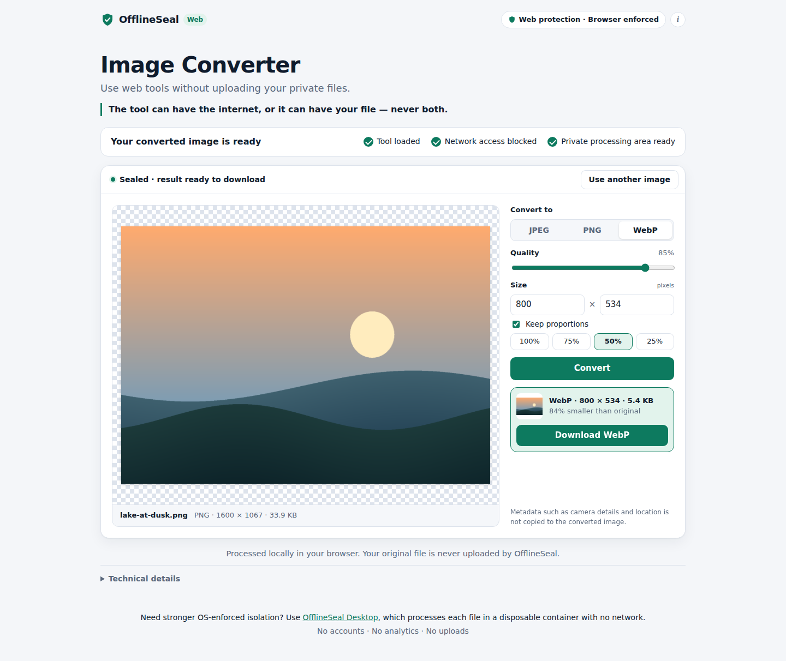

# OfflineSeal Web

> The tool can have the internet, or it can have your file — never both.

OfflineSeal Web is the zero-install edition of OfflineSeal. You open a link such as
`https://offlineseal.app/image` in a normal browser. The page downloads the
processing tool, seals it inside a browser sandbox with no network access, and
only then lets your file in. Your file is processed on your device, and the result
is saved as a normal download.

**Processed locally in your browser. Your original file is never uploaded by OfflineSeal.**

This first release has one tool, the **Image Converter**: PNG, JPEG, WebP, GIF, BMP
and AVIF in; PNG, JPEG or WebP out, with optional resizing.

| | OfflineSeal Web | OfflineSeal Desktop |
|---|---|---|
| Delivery | Shareable HTTPS URL, nothing to install | Local application and runtime |
| Where the file is processed | A sandboxed frame in your browser | A disposable container on your computer |
| Isolation | **Browser-enforced** (iframe sandbox + Content Security Policy) | **OS-enforced** (network namespace, `network=none`) |
| Claim | Browser policy stops the tool from making network requests | The tool is physically disconnected from the network |

The two editions share the same idea, but they do not make the same security
claims. Web mode never claims OS-level isolation.



---

## How it works

```
User opens /image
  │
  ▼
Outer shell (network-capable, same-origin only)
  1. downloads the tool payload            GET assets/sealed/image-converter.sealed.txt
  2. verifies it against a pinned SHA-384  fetch(…, { integrity })   ── mismatch → refuse
  3. creates <iframe sandbox="allow-scripts allow-downloads" srcdoc=…> (inert)
  │
  ▼
Sealed frame (opaque origin, no network): a small trusted UI + bootstrap layer
  4. removes WebRTC, creates its one Trusted Types policy for Worker URLs,
     then checks its own seal: origin is opaque · shell is unreachable ·
     its own connect-src 'none' is enforced
  5. starts a throwaway self-check Worker (no user data): the Worker checks its
     own seal (opaque origin, connect-src 'none', no storage) and reports its
     encoders → terminated
  6. posts `frame-ready`                   ── any check fails → `seal-failed` → shell shuts it down
  │
  ▼
Shell removes `inert`: READY
  │
  ▼
User drops or chooses an image INSIDE the frame
  7. frame hands the File straight to a fresh Worker ("inspect")
       Worker: re-checks its seal → sniffs → decodes → returns info + a preview bitmap → terminated
  8. on Convert, another fresh Worker ("convert")
       Worker: re-checks its seal → decodes → resizes → encodes → decodes its own
       output to verify it → returns the result Blob + a thumbnail → terminated
  9. frame offers the Blob as <a download href="blob:…">; the browser saves it
```

### Disposable Workers

Every job runs in its own brand-new dedicated Worker: the READY self-check,
inspecting a newly chosen file, and each conversion. The frame terminates the
Worker the moment its job completes, fails, times out, or is superseded.
Workers die with their frame.

- **One job per Worker.** A Worker accepts a single job and ignores any
  second one. The frame never has two Workers alive at once.
- **One file per frame.** "Use another image" destroys the frame, and with it
  any running Worker, before a new frame (and new Workers) exist.
- **No state carries over.** Each Worker starts as a fresh JavaScript global.
  Its origin is opaque, so it has no IndexedDB, no Cache Storage and no
  cookies: nothing persists after `terminate()`. The tests plant state in
  File A's Worker and confirm File B's Worker cannot see it.
- **Timeouts:** 5 s for the self-check, 60 s for inspect, 120 s for convert.
  After that the frame sends `cancel`, then terminates the Worker.

The invariant: **private file bytes are processed only inside a disposable
Worker, and destroying the Worker destroys the processing state.**

### Where your file exists and where it does not

| Place | Has the file or its bytes? |
|---|---|
| Processing Worker (opaque origin, no network, no DOM, no storage, lives for one job) | **Yes.** Reads the bytes, decodes the pixels, encodes the output. |
| Sealed frame (opaque origin, no network) | **A handle to the `File`**, which it passes to each job's Worker but never reads. **A display-sized preview bitmap** from the Worker, shown through a `bitmaprenderer` canvas; the frame never reads its pixels. **The result `Blob`**, offered for download; the frame never reads its bytes. The tests count every decode, canvas, `Blob`-read, `FileReader` and `Response` API call in the frame's realm and require zero. |
| Your Downloads folder | The converted result, when you click Download. |
| Outer shell page | **No.** It has no file input, never reads drop data, and receives only status messages. |
| OfflineSeal's server | **No.** There is no upload endpoint or processing API, and no request is made after READY. |

The shell learns only these status events: `frame-ready`, `seal-failed`,
`file-selected`, `processing-started`, `processing-complete` and
`processing-failed`. It does not even learn the file name.

### The shell ↔ frame protocol

- One direction only: frame → shell. The shell never posts anything to the frame,
  and the frame never listens for window messages.
- Six fixed message types. Every message must have exactly the keys `protocol`,
  `instance` and `type`, plus `code` on the two failure types, where it comes
  from a fixed list.
- Each message is checked for `event.source` (the live frame's window),
  `event.origin === "null"`, the frame instance id, its exact shape, and whether
  it is allowed in the current lifecycle state. Anything else is dropped and
  counted.
- No message can make the shell fetch, open, navigate, upload or run anything.
  There is no generic operation.

See [`src/shell/assets/protocol.js`](src/shell/assets/protocol.js).

### The frame ↔ Worker protocol

| Direction | Type | Exact payload (besides `protocol`) |
|---|---|---|
| frame → Worker | `self-check` | `job` |
| frame → Worker | `process-image` | `job`, `operation: "inspect"`, `file` (a `File`), `previewMax {width, height}` |
| frame → Worker | `process-image` | `job`, `operation: "convert"`, `file`, `previewMax`, `output {type, quality, width, height}` |
| frame → Worker | `cancel` | `job` |
| frame → Worker | `destroy` | none |
| Worker → frame | `self-check-passed` | `job`, `encoders` (a subset of JPEG/PNG/WebP) |
| Worker → frame | `processing-started` | `job` |
| Worker → frame | `processing-complete` | `job`, `operation`, `info`, `preview` (an `ImageBitmap`); for convert also `output` (a `Blob` whose type and size must match `info`) |
| Worker → frame | `processing-failed` | `job`, `code` from a fixed list |

Both sides accept exact key sets only. They check the job id, and check types
with `instanceof` against their own realm's `File`, `Blob` and `ImageBitmap`.
Anything else is dropped: the Worker sends no reply, and the frame logs it and
never acts on it. There is no `fetch-url`, proxy, eval, script or other generic
command. See [`src/sealed/worker-protocol.js`](src/sealed/worker-protocol.js).

---

## Security boundary: what browser mode enforces

**Enforced by the browser**, verified at runtime by the tests in Chromium 141 and Microsoft Edge 154:

- **Opaque origins.** The frame is sandboxed without `allow-same-origin`, so it
  cannot read the shell's DOM, cookies or storage. Its Workers inherit the
  opaque origin, so they have no persistent storage.
- **No network from the frame or its Workers.** `connect-src 'none'` and
  `default-src 'none'` cover fetch, XHR, `sendBeacon`, WebSocket, EventSource,
  WebTransport and every resource type. A Worker started from a `blob:` URL
  inherits the frame's policy; the tests probe from inside a live processing
  Worker while it holds the file.
- **No forms, popups or top-level navigation.** These sandbox flags are absent,
  and `form-action 'none'` is set.
- **No frame navigation to a URL.** The shell's `frame-src 'none'` stops the
  frame from navigating itself or a nested frame, including to same-origin URLs
  with data in the query string. If a navigation is attempted anyway, the shell
  sees the extra `load` event and destroys the frame. (One browser difference
  applies here; see below.)
- **No code the tool didn't ship.** `script-src` allows one SHA-256 hash, with no
  `'unsafe-inline'` and no `'unsafe-eval'`. Trusted Types allows no HTML sinks.
  Its one policy can mint exactly one script URL: the `blob:` URL of the pinned
  Worker code, which is embedded in the hashed script. So no other Worker,
  `importScripts()` or nested `srcdoc` can run, in the frame or in a Worker.
- **Pinned tool.** The shell uses the payload only if it matches the SHA-384
  compiled into the shell (Subresource Integrity). That covers the Worker code
  too.
- **Fail closed.** If the payload doesn't match, a frame or Worker seal check
  fails, the frame stays silent for 10 s, or the frame navigates, there is no
  processing area and no file can be added. A Worker that cannot verify its
  seal refuses the job before reading a single byte.

### Threat model after the Worker refactor

The processing code, meaning everything that parses untrusted image bytes,
now runs in the most restricted environment the browser offers a web page: a
dedicated Worker with an opaque origin, no DOM, no frames, no navigation, no
`RTCPeerConnection`, no storage, `connect-src 'none'`, and no way to load or
evaluate more code. It lives for one job.

The **frame** is now a small, trusted UI and bootstrap layer. It still runs in
a window, and a window has capabilities a Worker lacks. So the frame's code must
stay first-party and reviewed, and the static audit enforces that it never
touches bytes or pixels. What a *hostile frame script* could still do, if one
ever ran there:

- **WebRTC.** Neither CSP nor the sandbox governs WebRTC (STUN/TURN over UDP),
  and Chromium 141 and Edge 154 do not implement CSP3's `webrtc 'block'`. The
  frame deletes the WebRTC constructors before any other code runs. This is
  **JavaScript-level hardening, not a browser boundary**. Workers have no
  `RTCPeerConnection` at all, so the processing code cannot use WebRTC.
- **Connection-only signals in Edge.** Measured: Microsoft Edge 154 opens a
  TCP connection, and so resolves the host name, to the target of a *frame
  navigation* (`<iframe src>`, meta refresh, self-navigation) before
  `frame-src 'none'` blocks it. No HTTP request is sent. Chromium 141 opens no
  connection. In Edge, a frame script could therefore leak data through a
  chosen host name. Workers cannot navigate or create frames, so this does not
  apply to the processing code (the Worker probes show zero connections in
  Edge).

We do not claim that arbitrary hostile JavaScript is network-isolated by
this design. The claim is narrower: the code that processes your file runs
where no network channel we know of is available, and the tests hold it to
that.

**Other limits**, stated plainly:

- **DNS.** In Chromium 141, `dns-prefetch`/`preconnect` and blocked navigations
  produced no connection, and `x-dns-prefetch-control: off` is set. A local HTTP
  test server cannot observe DNS lookups themselves.
- **Browser extensions** that can read page content can read the frame too.
- **The browser itself.** The browser vendor's own services (sync, safe-browsing
  checks on downloads, crash reports) are outside what a web page can control.
- **The tool is first-party.** Browser policy stops the processing code from
  using the network. It does not stop it from putting wrong pixels in your
  output. The Image Converter is written and reviewed as part of OfflineSeal.

Need OS-enforced isolation instead? That is what OfflineSeal Desktop is for.

---

## Exact policies

The policies are generated from one module, [`src/policy.mjs`](src/policy.mjs), by
`build.mjs`. The hashes change whenever the tool's code changes; the current values
are in `dist/build-info.json` after a build.

**Sealed frame sandbox** (checked on the live DOM by the tests):

```
sandbox="allow-scripts allow-downloads"
```

`allow-downloads` is required. Without it, Chromium silently drops the
`<a download>` click and no file is saved (verified). Every other token is absent,
including `allow-same-origin`, `allow-forms`, `allow-popups`, `allow-modals` and
all `allow-top-navigation*`.

**Sealed frame CSP** (a `<meta>` in the payload; `srcdoc` documents cannot have HTTP headers):

```
default-src 'none'; script-src 'sha256-<tool script>'; style-src 'sha256-<tool style>';
img-src 'none'; media-src 'none'; font-src 'none'; connect-src 'none'; form-action 'none';
frame-src 'none'; child-src 'none'; worker-src blob:; object-src 'none'; manifest-src 'none';
base-uri 'none'; require-trusted-types-for 'script'; trusted-types offlineseal-worker-script
```

The frame also inherits the shell's header CSP below, and its Workers inherit
both. All of them apply.

**Why `worker-src blob:`.** An opaque-origin document can start a Worker only
from a `blob:` or `data:` URL (a URL Worker must be same-origin, and an opaque
origin is same-origin with nothing), and `blob:` is the narrower of the two.
Trusted Types narrows it to one URL. The `offlineseal-worker-script` policy is
created first thing in the frame; Trusted Types forbids a second policy with that
name, and its `createScriptURL` accepts only the `blob:` URL made from the pinned
Worker code. The tests confirm that the frame cannot start a Worker from any
other `blob:` URL, and that a Worker cannot start one at all.
`connect-src` is still `'none'`, and there are no third-party dependencies.

**Shell CSP** (HTTP header; the page also carries the same policy as a `<meta>` fallback, without `frame-ancestors`):

```
default-src 'none'; script-src 'self' 'sha256-<tool script>'; style-src 'self' 'sha256-<tool style>';
img-src 'self'; connect-src 'self'; frame-src 'none'; child-src 'none'; worker-src blob:;
form-action 'none'; object-src 'none'; media-src 'none'; font-src 'none'; manifest-src 'none';
base-uri 'none'; require-trusted-types-for 'script';
trusted-types offlineseal-sealed-frame offlineseal-worker-script; frame-ancestors 'none'
```

The shell's `worker-src blob:` and the extra Trusted Types name exist only
because the frame inherits this policy. The shell itself cannot start a Worker:
its only Trusted Types policy has no `createScriptURL`.

**Other response headers**:

```
Permissions-Policy: accelerometer=(), attribution-reporting=(), autoplay=(), browsing-topics=(),
  camera=(), clipboard-read=(), clipboard-write=(), compute-pressure=(), display-capture=(),
  encrypted-media=(), fullscreen=(), gamepad=(), geolocation=(), gyroscope=(), hid=(),
  identity-credentials-get=(), idle-detection=(), local-fonts=(), magnetometer=(), microphone=(),
  midi=(), otp-credentials=(), payment=(), picture-in-picture=(), publickey-credentials-create=(),
  publickey-credentials-get=(), screen-wake-lock=(), serial=(), storage-access=(), sync-xhr=(),
  usb=(), window-management=(), xr-spatial-tracking=()
Referrer-Policy: no-referrer
X-Content-Type-Options: nosniff
X-Frame-Options: DENY
Cross-Origin-Opener-Policy: same-origin
Cross-Origin-Resource-Policy: same-origin
Origin-Agent-Cluster: ?1
X-DNS-Prefetch-Control: off
Strict-Transport-Security: max-age=31536000
```

The converter needs no browser permission, so every feature is `()`. `bluetooth`
and `web-share` are left out because Chromium 141 reports them as unrecognised
and ignores them. Edge 154 also does not recognise `attribution-reporting` (Edge
ships without that API). It stays listed because Chrome has it.

`Cross-Origin-Embedder-Policy` is deliberately **not** set. It would enable
cross-origin isolation (SharedArrayBuffer), which the tool doesn't need. The CSP
already blocks every cross-origin load, so COEP would add no protection here.

---

## Develop and test

```sh
cd web
npm ci
npx playwright install chromium   # not needed where Chromium is preinstalled
npm test                          # build + 42 unit tests + 28 browser tests
npm run serve                     # http://127.0.0.1:8080/image
npm run evidence                  # screenshots + network log into docs/
```

| Suite | What it checks |
|---|---|
| `test/unit/protocol` | Message allowlist and lifecycle state machine. |
| `test/unit/policy` | Sandbox tokens; every CSP directive; no wildcard, scheme, `unsafe-*` or host sources; required headers. |
| `test/unit/build` | Payload integrity, script/style hashes, CSP placement, no external URLs, trackers or fonts, deterministic output. |
| `test/unit/sealed-audit` | The tool code uses no network API, no eval/HTML sinks, and posts only protocol messages. The shell never reads files. |
| `test/unit/server`, `converter-core` | Clean URLs and headers; converter maths, format sniffing, file names. |
| `test/e2e/policy` | Live iframe sandbox, opaque origin, enforced frame CSP, response headers, Permissions-Policy, frame-ancestors. |
| `test/e2e/network-probes` | 36 benign probe channels from the live frame (details below). Positive controls; self-navigation; shell online but no relay. |
| `test/e2e/data-isolation` | A synthetic marker image end to end with the shell realm and server instrumented, plus a positive control for the detector. |
| `test/e2e/messages` | 16 hostile messages have no effect; messages from other windows are ignored; COOP severs openers. |
| `test/e2e/lifecycle` | No file admission before READY; tamper, seal-failure and timeout paths fail closed; a fresh frame per image; drops on the page are ignored. |
| `test/e2e/conversion` | PNG→JPEG/WebP/PNG, resize, alpha flattening, JPEG/GIF input, drag and drop, bad input. Outputs are decoded in a separate clean page. |

The probe channels cover fetch (same-origin, cross-origin, POST, keepalive), XHR,
sendBeacon, WebSocket, EventSource, WebTransport, image, SVG image, CSS
background, CSSOM `@import`, FontFace, stylesheet, prefetch, preload,
modulepreload, preconnect, dns-prefetch, script, iframe, object, embed, Worker,
SharedWorker, audio, video poster, GET and POST forms, `window.open`, top
navigation, `target=_top` and `_blank` links, meta refresh, WebRTC (direct and via
a nested frame), and nested `srcdoc`. The pass condition is that the probe servers
observe **zero** HTTP requests, TCP connections, WebSocket upgrades and UDP
packets.

The probes carry only a fixed harmless string, never file content. They show what
the browser enforced in this run; they are not proof against every conceivable
browser behaviour.

### Browser support

| Browser | Status |
|---|---|
| Chrome / Chromium 141 | **Automated.** All tests run here. |
| Edge | Chromium-based, so expected to behave the same. **Not run.** |
| Firefox | **Not run.** Firefox could not be installed in the environment used for this release. Expected differences: Trusted Types support depends on version (without it, the shell falls back to a plain string for `srcdoc`, and the frame loses its Trusted Types defences); `document.featurePolicy` doesn't exist, so the Permissions-Policy test is Chromium-specific. The frame's seal self-check still runs, so a Firefox that failed to enforce `connect-src` would fail closed. |
| Safari | Not a target. It has no WebP encoder, so the frame hides the WebP option. |

## Deploy

See [`deploy/README.md`](deploy/README.md). In short: run `npm run build` and serve
`web/dist/` over HTTPS with the headers from `dist/_headers`. Cloudflare Pages and
Netlify read `_headers` automatically, and an nginx example is included.
